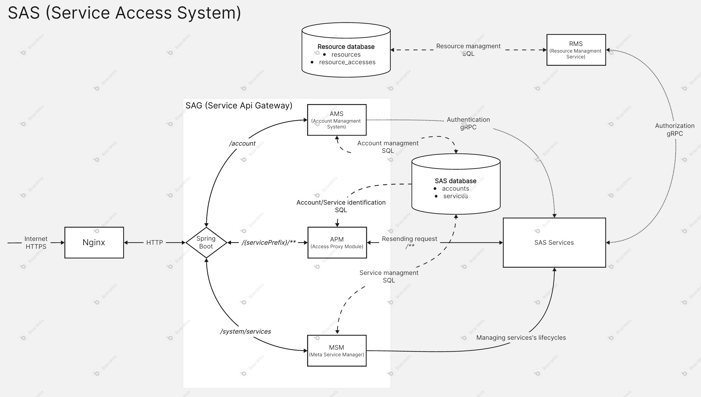

# SAS (Service Access System)

`SAS` is a system for managing services, unified login, accounts and resource access.

## Nginx

First component is `Nginx` proxy server which proccesses `HTTPS` requests and resends them as `HTTP` to [SAG](sag.md).

## SAG

[SAG](sag.md)

Main component of `SAS`. Managing accounts, authentication, services and resending requests to them.

## RMS

[RMS](rms.md)

Internal service for managing resources to relieve need of databases and access management for small services.

## SAS Services

Those are the services with wanted logic. It could be anything I want.
`SAS Services` are using `SAS` tools and functions like [RMS](rms.md) or [AMS](sag.md#ams-account-managment-system) via `gRPC`.

Every `SAS Service` have unique name which will be used as `servicePrefix` and identifier of incomming request.

`SAS Services` could use any protocol to communicate [APM](sag.md#apm-access-proxy-module) but [SAG](sag.md) (client communication) will be only accessible via `HTTPS`. Different protocols will have different drivers coded inside [SAG](sag.md).

> It means that client needs to use `HTTPS`, it could be just `POST` with some data inside its body and [APM](sag.md#apm-access-proxy-module) would choose the driver for selected service.

> Hardcoded drivers applies for first versions. In future versions there should be plugins as drivers for easier driver development. (or maybe not :) maybe it will stay hardcoded because it would be unnecesary)

In case `SAS Service` wants to communicate via `HTTP`, then [APM](sag.md#apm-access-proxy-module) sends `HTTP` request with same path, except service's prefix would be cut off.

> If client sends `https://localhost/notes/get?noteId=12` then [APM](sag.md#apm-access-proxy-module) sends `http://localhost/get?noteId=12` to service with prefix `notes`.

